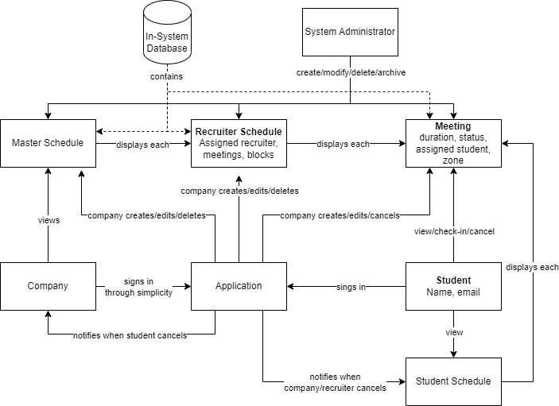

# Kiosk Warriors
Group Senior Project Front-facing Website

## Roles
Evan - Scrum Master / PM 
Brendan - Full-stack 
Jack- Communications Lead 
Frank - Tech lead 
Jason - Frontend 
Geran - Documentation/Backend 

## Synopsis
The purpose of the project is to automate the employer/student interactions during the career fair. This includes signing up for and signing into interviews. Employers can create as many schedules as needed depending on how many interviewers they decide to bring to interview day.  After determining which students they will interview, employers can schedule the students on any of their schedules as long as the student is available during the chosen interview block. Each student will also have their own schedule which will let them view, cancel, and check in to interviews. When a student checks in or cancels an interview, the interviewer gets notified via a change in the status of the interview object on their schedule. The student’s schedule view will also help the student know where to go for their interview by including details such as which “zone” they will be interviewed in. The application must also be able to export all scheduled data to Symplicity’s systems. 

## Hours
[Link to hours](https://docs.google.com/spreadsheets/d/1xAHLvo-fBwB6ZvhZdQ5gmMZXveX7XbWQiBJ8mm3cors/edit?usp=sharing)

| Name                 | Role                        | Week 2 Hours | Week 3 Hours | Week 4 Hours | Week 5 Hours | Week 6 Hours | Week 7 Hours | Week 8 Hours | Week 9 Hours | Week 10 Hours | Week 11 Hours | Week 12 Hours | Week 13 Hours | Week 14 Hours | Week 15 Hours |
| -------------------- | --------------------------- | ------------ | ------------ | ------------ | ------------ | ------------ | ------------ | ------------ | ------------ | ------------- | ------------- | ------------- | ------------- | ------------- | ------------- |
| Brendan              | Full-Stack                  | 3            | 3            | 3            | 5            |              |              |              |              |               |               |               |               |               |               |
| Evan                 | Scrum Master/PM             | 3            | 3            | 3            | 5.25         |              |              |              |              |               |               |               |               |               |               |
| Frank                | Tech Lead                   | 3            | 3            | 3            | 4            |              |              |              |              |               |               |               |               |               |               |
| Geran                | Documentation / Backend     | 3            | 3            | 3            | 4            |              |              |              |              |               |               |               |               |               |               |
| Jack                 | Communications Lead/Backend | 3            | 3            | 3            | 5            |              |              |              |              |               |               |               |               |               |               |
| Jason                | Frontend Dev                | 3            | 3            | 3            | 6            |              |              |              |              |               |               |               |               |               |               |
| =/=                  | Total Hours for Week        | 18           | 18           | 18           | 29.25        | 0            | 0            | 0            | 0            | 0             | 0             | 0             | 0             | 0             | 0             |

## Domain Model

[Domain Model.pdf](https://github.com/BrendanMYoung/KioskWarriorsWebsite/files/12694047/Domain.Model.pdf)

## Development Methodology
### Reasoning
Our team has decided to go with an agile methodology to achieve the frequent deliverables required for this project. There are a few main factors contributing to our decision:  
-Frequent customer involvement 
-Evolutionary artifacts 
-Rapid Prototyping 
-Relatively simple system design 
-Real-world and educational experience 
### Chosen Methodology:
Scrum is our chosen methodology, and we will be using Trello to track our backlog of tasks/stories for development. The board will have the following 5 active columns:  
-Sprint Backlog 
-In Progress 
-Ready for Tests 
-In Tests 
-Done 

### Metrics:
Sprint Velocity: N/A  
Learnability: N/A 
Ease of use: N/A 
Defects: N/A 
Test Metrics:N/A 
## Milestones
Authentication with Symplicity  
Backend dataflow 
Scheduling 
Employer View 
Student View 
Interview Notifications 
Administration Tools 

## Communication Plan
Our communication plan is to meet with our stakeholders every Thursday to go over requirements, project process, and any questions we have concerning the project. Everytime we finish a deliverable, the communications lead will send it to both our coach and the sponsors for their feedback. We also have our coach present in the discord, so he is easily able to get in contact with us whenever needed. Furthermore, additional stakeholder management will come in the form of demoing our prototype to them at the end of each development cycle.

## Keywords
Career, Fair, Scheduling, Symplicity, Interview
